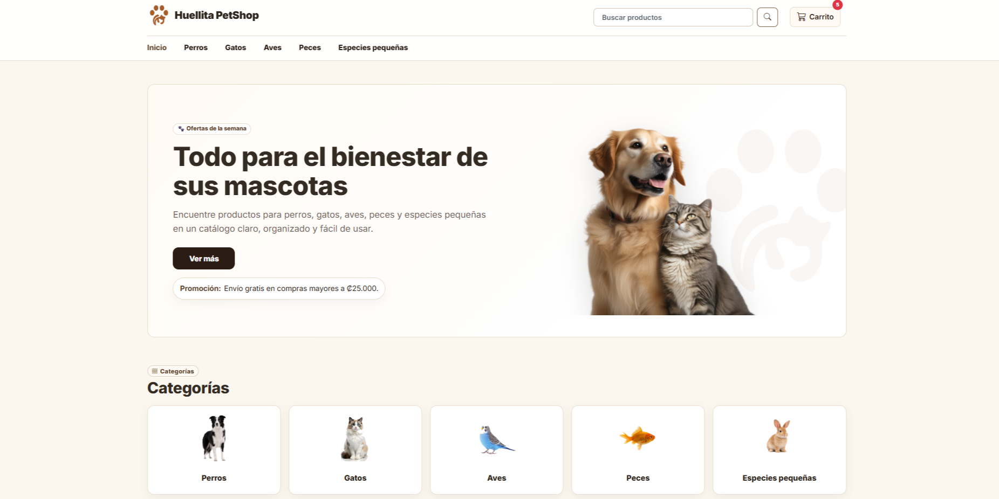

# 🐾 PetShop UNA

<div align="center">

### Responsive Pet E-Commerce Prototype

Modern shopping experience focused on responsive design, usability, and clean UI.

🔗 **Live Demo**
https://andcarrillo.github.io/PetShop/
<div align="center">



</div>
<br>


</div>

---

# 📌 Overview

PetShop UNA is a responsive e-commerce prototype developed using **HTML5, CSS3, JavaScript, and Bootstrap 5**.

The project focuses on:

* responsive layouts
* shopping flow usability
* product exploration
* search and filtering
* dynamic cart interactions
* validated checkout experience

---

# ✨ Features

| Module      | Description                              |
| ----------- | ---------------------------------------- |
| 🏠 Home     | Hero section, categories, promotions     |
| 🛍 Catalog  | Responsive product grid                  |
| 🔎 Search   | Filters by species, category, and price  |
| 📦 Details  | Product information and related products |
| 🛒 Cart     | Dynamic quantity and totals              |
| 💳 Checkout | Responsive validated form                |

---

# 🛠 Tech Stack

| Technology      | Usage         |
| --------------- | ------------- |
| HTML5           | Structure     |
| CSS3            | Styling       |
| Bootstrap 5     | Responsive UI |
| JavaScript      | Dynamic logic |
| Bootstrap Icons | Icons         |

---

# 📱 Responsive Design

Optimized for:

* Mobile
* Tablet
* Desktop

Includes:

* Bootstrap Grid System
* Adaptive layouts
* Responsive forms
* Mobile-first structure

---

# 📂 Project Structure

```txt id="whf0k6"
PetShop-UNA/
│
├── index.html
├── productos.html
├── detalle.html
├── busqueda.html
├── carrito.html
├── checkout.html
│
├── assets/
│   ├── css/
│   ├── js/
│   └── img/
│
└── catalogo_petshop.csv
```

---

# 🚀 Getting Started

## Live Server

1. Open the project in VS Code
2. Install Live Server
3. Run `index.html`

---

# 📄 License

Copyright © 2026 Andrea Carrillo

All Rights Reserved.

Unauthorized reproduction, redistribution, or commercial usage without permission is prohibited.

---

# 👨‍💻 Author

**Andrea Carrillo**
Front-End Development • Responsive Design • UI/UX
